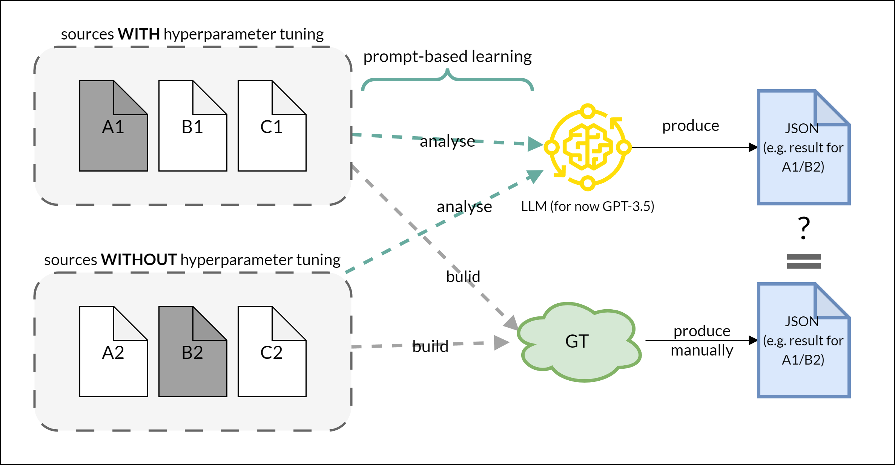

# Task on RLOps and LLM for automation of RL-architecture2 and non-fct requirements architecture

> procedure to solve the task

    

- ***Benefit***: 
**Automation** **of** the **analysis** process by training an LLM specifically for RL architectural features using fine tuning (here “hyperparameter tuning”). This allows the RLOps process to be significantly accelerated, since, for example, communication about the architectures used by different RL projects can be recognized and communicated more quickly.

## I. procedure

1. Collect a small dataset (around 3-5 instances) of RL source code examples that apply hyperparameter tuning. The examples should ideally use various programming languages, environments (e.g. Python scripts, Jupyter notebooks, etc.), techniques, libraries, and so on so that the examples aren't all similar. Also, find around 3-5 examples with no hyperparameter tuning.

2. Define a machine-readable schema (e.g. JSON, XML, etc.) for storing the information discovered in source code about hyperparameter tuning. At a minimum, the relevant line numbers, but additional information on, e.g. the actual hyperparameter values used, the libraries used, etc., would be interesting too.

3. Create reference (ground truth) files for each source code example, applying your defined schema.

4. Use an LLM to analyse the source code for hyperparameter tuning and output the results in your machine-readable schema. 
[Due to time constraints and a lack of current training opportunities, the LLM GPT-3.5 (= "normal" ChatGPT-3.5) was used.]

5. Perform a basic comparison, (programmatic or otherwise, e.g. (semi-)automated), to compare what the LLM found with your ground truth.

## II. repo contains

a) source code instances
b) ground truth files
c) LLM prompts with LLM output (as JSON)
d) summary/discussion

## III. summary/discussion
...